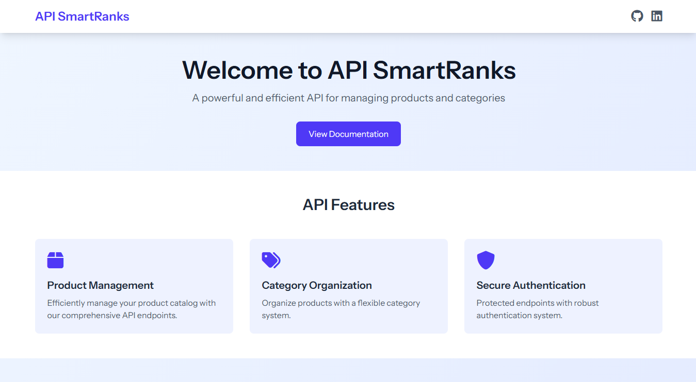
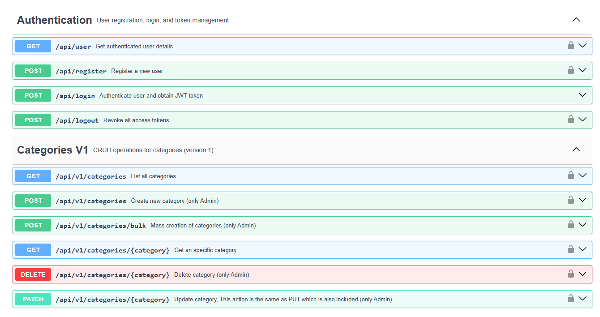

# SmartRanks Technical Test API

<div align="center">

## 🌐 Live Demo
</div>

<div align="center">
  <a href="https://www.technical-test.site" target="_blank">
    
  </a>

  <h3 align="center">SmartRanks Technical Test API Proyect</h3>

  <p align="center">
    A robust RESTful API built with Laravel 12 for managing products and categories with role-based access control. This project demonstrates best practices in API development, authentication, and authorization.
    <br />
    <a href="https://github.com/afmurillo97/TECHNICALL_TEST_SMARTRANKS"><strong>Explore the docs »</strong></a>
    <br />
    <br />
    <a href="https://www.technical-test.site" target="_blank">Visit the Production Site</a>
    ·
  </p>
</div>

## About Author

👨‍💻 **Felipe Murillo** - Full Stack Developer

- 🌐 [GitHub](https://github.com/afmurillo97)
- 📧 Email: afmurillo97@gmail.com
- 🔗 [LinkedIn](https://www.linkedin.com/in/felipe-murillov/)

### Skills & Expertise
- Backend Development (PHP, Laravel, Node.js)
- Frontend Development (React, Vue.js, JavaScript)
- Database Design & Management
- API Development & Integration
- DevOps & CI/CD
- Agile Methodologies

## Table of Contents

- [Features](#features)
- [Technology Stack](#technology-stack)
- [Prerequisites](#prerequisites)
- [Installation and Configuration](#installation-and-configuration)
- [API Documentation](#api-documentation)
- [Authentication](#authentication)
- [API Endpoints](#api-endpoints)
- [Design Decisions](#design-decisions)
- [Testing](#testing)
- [Deployment](#deployment)

## Default Credentials

The application comes with two default users for testing purposes:

### Admin User
- Email: admin@example.com
- Password: password
- Role: Admin

### Regular User
- Email: user@example.com
- Password: password
- Role: User

<div align="center">
  <a href="https://www.technical-test.site" target="_blank">
    
  </a>
</div>

These credentials are created during the database seeding process. For security reasons, please change these passwords in a production environment.

## Features

- 🔐 JWT-based authentication system
- 👥 Role-based access control (Admin/User)
- 📦 Product management with categories
- 🔍 Advanced filtering and search capabilities
- 📝 Comprehensive API documentation with Swagger/OpenAPI
- 🛡️ Input validation and error handling
- 📊 Pagination for list endpoints
- 🔄 Bulk operations support
- 🎯 RESTful API design principles

## Technology Stack

- PHP 8.2
- Laravel 12.0
- MySQL/SQLite
- Composer
- Laravel Sanctum for authentication
- NPM for frontend assets
- Swagger/OpenAPI for documentation

## Prerequisites

Before you begin, ensure you have the following installed:
- PHP 8.x
- Composer
- MySQL/PostgreSQL/SQLite
- Node.js and NPM (for frontend assets if needed)

## Installation and Configuration

1. Clone the repository:
```bash
git clone https://github.com/afmurillo97/TECHNICALL_TEST_SMARTRANKS.git
cd TECHNICALL_TEST_SMARTRANKS
```

2. Install PHP dependencies:
```bash
composer install
```

2. Create environment file:
```bash
cp .env.example .env
```

4. Generate application key:
```bash
php artisan key:generate
```

5. Configure your database in `.env`:

```env
APP_NAME="API RESTFULL SMART RANKS"
APP_ENV=local
APP_DEBUG=true
APP_URL=http://localhost:8000 (or your own Virtual Host)

L5_SWAGGER_UI_PERSIST_AUTHORIZATION=true

DB_CONNECTION=mysql
DB_HOST=127.0.0.1
DB_PORT=3306
DB_DATABASE=smartranks_tt_db
DB_USERNAME=your_username
DB_PASSWORD=your_password
```

6. Run migrations and seed database:
```bash
php artisan migrate --seed
```

7. Start the development server (skip this step if you have your own virtual host):
```bash
php artisan serve
```

### Setting up Swagger Documentation

1. Install required npm packages:
```bash
npm install
```

2. For development, you can enable auto-generation of documentation in .env file:
```env
L5_SWAGGER_GENERATE_ALWAYS=true
```

3. Generate the API documentation:
```bash
php artisan l5-swagger:generate
```

4. Start the frontend server:

For Development:
```bash
npm run dev
```

For Production:
```bash
npm run build
```
## API Documentation

1. Access the documentation:
- Development: `http://localhost:8000/api/documentation`
- Production: `https://your-domain/api/documentation`

The API documentation is available at `/api/documentation` when running the application. It provides detailed information about all endpoints, request/response formats, and authentication requirements.


2. Use the Swagger UI to:
   - Explore all available endpoints
   - Test API calls directly from the interface
   - View request/response schemas
   - Download OpenAPI specification

3. Authentication in Swagger UI:
   - Click the "Authorize" button
   - Enter your Bearer token
   - All subsequent requests will include the token

4. Testing endpoints:
   - Expand any endpoint to see details
   - Click "Try it out"
   - Fill in required parameters
   - Execute the request
   - View the response

## Authentication

The API uses Laravel Sanctum for authentication. To access protected endpoints:

1. Register a new user and login to get a token
2. Include the token in your requests:
```
Authorization: Bearer your-token-here
```

### Authentication Endpoints

- `POST /api/register` - Register a new user
- `POST /api/login` - Login and get access token
- `POST /api/logout` - Logout and invalidate token
- `GET /api/user` - Get authenticated user details

## API Endpoints

### Products

- `GET /api/v1/products` - List all products
- `GET /api/v1/products/{id}` - Get product details
- `POST /api/v1/products` - Create new product (Admin only)
- `PUT /api/v1/products/{id}` - Update product (Admin only)
- `DELETE /api/v1/products/{id}` - Delete product (Admin only)
- `POST /api/v1/products/bulk` - Bulk create products (Admin only)

### Categories

- `GET /api/v1/categories` - List all categories
- `GET /api/v1/categories/{id}` - Get category details
- `POST /api/v1/categories` - Create new category (Admin only)
- `PUT /api/v1/categories/{id}` - Update category (Admin only)
- `DELETE /api/v1/categories/{id}` - Delete category (Admin only)
- `POST /api/v1/categories/bulk` - Bulk create categories (Admin only)

## Design Decisions

### Role Management
- **Simple Enum Approach**: For this technical test, I used an enum field (`admin|user`) in the users table instead of a separate roles table. This decision was made considering:
  - The project scope is limited to a technical test
  - Only two roles are needed (admin and user)
  - Simplicity in implementation and maintenance
  - Direct performance benefits by avoiding joins

- **Future Scalability Considerations**: In a production environment, I would implement:
  - A separate `roles` table with many-to-many relationships
  - A `permissions` table for granular access control
  - Role-based token generation with specific permissions
  - Token expiration and refresh mechanisms
  - Audit logging for role changes

### Authentication & Authorization
- **Laravel Sanctum Implementation**:
  - Token-based authentication for API security
  - Stateless authentication for better scalability
  - Secure password hashing using Laravel's built-in mechanisms
  - Custom middleware for role-based access control
  - Token expiration and refresh capabilities

### API Structure
- **Versioned API (V1)**:
  - Future-proof design allowing for API evolution
  - Backward compatibility support
  - Clear separation of concerns
  - Consistent response format across all endpoints

- **RESTful Design Principles**:
  - Resource-based routing
  - Proper HTTP method usage (GET, POST, PUT, PATCH, DELETE)
  - Standard status codes
  - Clear endpoint naming conventions

- **Input Validation & Error Handling**:
  - Form Request validation classes
  - Comprehensive error messages
  - Data sanitization and normalization
  - Type casting and formatting

### Database Design

#### Users Table
```sql
users
├── id (bigint, primary key)
├── name (string)
├── role (enum: 'admin', 'user')
├── email (string, unique)
├── email_verified_at (timestamp, nullable)
├── password (string)
├── remember_token (string, nullable)
├── created_at (timestamp)
└── updated_at (timestamp)
```

#### Categories Table
```sql
categories
├── id (bigint, primary key)
├── name (string)
├── description (longText, nullable)
├── featured_image (string, nullable) //the URL that contains the category image
├── status (boolean, default: false) //gives the possibility to on/off a category for the public
├── created_at (timestamp)
└── updated_at (timestamp)
```

#### Products Table
```sql
products
├── id (bigint, primary key)
├── category_id (bigint, foreign key)
├── name (string)
├── sku (string, unique) //allows you to create a unique code that is public for the product
├── description (longText, nullable)
├── purchase_price (decimal(8,2), default: 0.00) //It allows for more precise control of the product
├── sale_price (decimal(8,2), default: 0.00) //price to avoid negative profits.
├── stock (integer, default: 0)
├── featured_image (string, nullable) //the URL that contains the product image
├── status (boolean, default: false) //gives the possibility to on/off a product for the public
├── created_at (timestamp)
└── updated_at (timestamp)
```

### Database Optimization
- **Indexing Strategy**:
  - Primary keys on all tables
  - Foreign key constraints for data integrity
  - Unique constraints on email and SKU
  - Appropriate indexes for frequently queried fields

- **Data Types**:
  - Precise decimal types for monetary values
  - Appropriate string lengths
  - Nullable fields where appropriate
  - Boolean flags for status fields

### Security Considerations
- **API Security**:
  - JWT token-based authentication
  - Role-based access control
  - Input validation and sanitization
  - Rate limiting implementation
  - CORS configuration

- **Data Protection**:
  - Password hashing
  - Secure session management
  - SQL injection prevention
  - XSS protection
  - CSRF protection

### Performance Optimization
- **Query Optimization**:
  - Eager loading of relationships
  - Proper indexing
  - Pagination for list endpoints
  - Caching strategies
  - Bulk operation support

### Testing Strategy
- **Comprehensive Testing**:
  - Unit tests for business logic
  - Feature tests for API endpoints
  - Authentication tests
  - Authorization tests
  - Database seeding for testing

### Documentation
- **API Documentation**:
  - Swagger/OpenAPI integration
  - Detailed endpoint descriptions
  - Request/response examples
  - Authentication requirements
  - Error response formats

## Testing

Run the test suite:

```bash
php artisan test
```

The test suite includes:
- Unit tests
- Feature tests
- API endpoint tests
- Authentication tests
- Authorization tests

## Deployment

### Production Deployment Steps

1. Set up your production environment, in this case I use Hostinguer VPS:
```bash
APP_ENV=production
APP_DEBUG=false
```

2. Configure your web server (Apache/Nginx) to point to the `public` directory

3. Set up SSL certificate for secure communication

4. Configure your database:
```bash
DB_CONNECTION=mysql
DB_HOST=your_database_host
DB_PORT=3306
DB_DATABASE=your_database_name
DB_USERNAME=your_database_user
DB_PASSWORD=your_database_password
```

5. Deploy your application via SSH:
```bash
# Clone the repository
git clone https://github.com/afmurillo97/TECHNICALL_TEST_SMARTRANKS.git
cd TECHNICALL_TEST_SMARTRANKS

# Install PHP dependencies
composer install --optimize-autoloader --no-dev

# Generate application key
php artisan key:generate

# Run database migrations
php artisan migrate --force

# Optimize Laravel
php artisan config:cache
php artisan route:cache
php artisan view:cache

# Install and build frontend assets
npm install
npm run build

# Set proper permissions
chmod -R 775 storage bootstrap/cache
chown -R www-data:www-data storage bootstrap/cache
```

### Deployment Considerations

- **Security**:
  - Keep all software and dependencies updated
  - Use strong passwords for all services
  - Enable firewall and configure security groups
  - Set up regular backups
  - Monitor server logs for suspicious activity

- **Performance**:
  - Enable OPcache for PHP
  - Configure Redis for caching (optional)
  - Set up proper database indexes
  - Enable compression in web server
  - Configure CDN for static assets

- **Monitoring**:
  - Set up server monitoring (CPU, RAM, Disk)
  - Configure application logging
  - Set up error tracking
  - Monitor database performance
  - Set up uptime monitoring

- **Maintenance**:
  - Schedule regular backups
  - Set up automated security updates
  - Monitor disk space usage
  - Keep SSL certificates up to date
  - Regular security audits

### Troubleshooting

If you encounter issues during deployment:

1. Check Laravel logs:
```bash
tail -f storage/logs/laravel.log
```

2. Verify file permissions:
```bash
ls -la storage bootstrap/cache
```

3. Check web server logs:
```bash
tail -f /var/log/apache2/error.log  # For Apache
tail -f /var/log/nginx/error.log    # For Nginx
```

4. Verify environment configuration:
```bash
php artisan config:clear
php artisan cache:clear
```

5. Check database connection:
```bash
php artisan db:monitor
```

## License

This project is licensed under the MIT License - see the LICENSE file for details.
